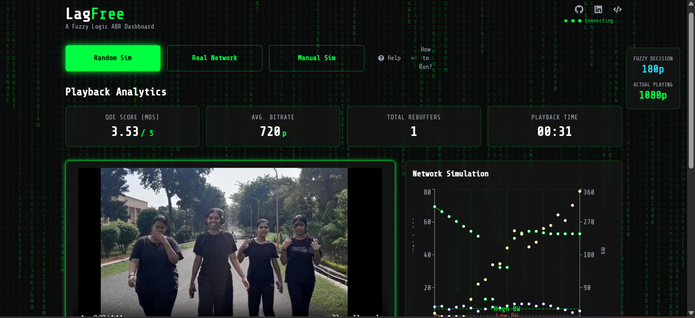

# 🚀 LagFree StreamLink: Fuzzy ABR Optimizer

LagFree StreamLink is a full-stack web application that demonstrates an intelligent Adaptive Bitrate (ABR) algorithm for video streaming. Instead of a traditional ABR, this project uses a **Fuzzy Logic Engine** to make real-time decisions on video quality, balancing playback smoothness and high resolution.

This system is designed to minimize rebuffering events and maximize the user's Quality of Experience (QoE) by intelligently adapting to unstable network conditions.

https://lagfree.vercel.app/




---

## ✨ Features

* **Fuzzy Logic ABR:** A Python-based [Mamdani Fuzzy Inference System](https://en.wikipedia.org/wiki/Fuzzy_logic#Mamdani-type) (using `scikit-fuzzy`) that ingests network stats and outputs the optimal bitrate.
* **HLS Video Player:** A modern React video player using `hls.js` to dynamically change video quality.
* **Real-time Analytics:** Get a live Quality of Experience (QoE) "MOS" score, average bitrate, playback time, and total rebuffer count.
* **Live Network Dashboard:** A real-time `recharts` graph visualizes bandwidth, buffer health, and delay.
* **Multi-Mode Simulation:**
    * **Random Sim:** Simulates a fluctuating network to stress-test the fuzzy engine.
    * **Manual Sim:** Use sliders to manually control bandwidth, buffer, and delay.
    * **Real Network:** Runs the ABR based on your browser's *actual* network conditions (via `navigator.connection`).
* **Backend Logging:** The Node.js server logs all API requests and fuzzy logic decisions.

---

## 🔧 How It Works: The Architecture

The project is split into three main services:


1.  **`client` (React Frontend):**
    * The user interface built in React.
    * Every 3 seconds, it gathers network conditions (bandwidth, buffer, delay) based on the selected mode.
    * It sends this data to the Node.js backend.
    * It receives the "fuzzy decision" (e.g., 720p) from the backend and instructs the `hls.js` player to switch to that quality level.

2.  **`server` (Node.js Backend):**
    * A simple Express.js server that acts as a proxy and API gateway.
    * It receives the JSON data from the React client.
    * It forwards this data to the Python Fuzzy Engine for a decision.
    * It logs the request/response and returns the final bitrate to the React client.

3.  **`fuzzy_engine` (Python Flask API):**
    * This is the "brain" of the project.
    * It's a Flask server running a `scikit-fuzzy` control system.
    * **Fuzzification:** It takes crisp inputs (e.g., `delay = 50ms`) and maps them to fuzzy sets (e.g., `delay is 'low'`).
    * **Rule Evaluation:** It applies a set of human-readable rules (e.g., `IF delay is 'high' OR buffer is 'empty' THEN bitrate is 'panic'`).
    * **Defuzzification:** It converts the resulting fuzzy output back into a single crisp number (e.g., `bitrate = 360`) and sends it back to the Node.js server.

---

## 💻 Tech Stack

* **Frontend:** React, HLS.js, Recharts, Tailwind CSS, Framer Motion
* **Backend:** Node.js, Express.js, Axios
* **Fuzzy Engine:** Python, Flask, scikit-fuzzy, NumPy

---

## 📁 Project Structure

```

lagfree/ 
├── client/ # React Frontend 
│ ├── public/ 
│ │ └── videos/hls/ # HLS video segments (.m3u8, .ts) 
│ ├── src/ 
│ │ ├── components/ 
│ │ │ ├── ui/ 
│ │ │ ├── AnalyticsDashboard.js 
│ │ │ ├── Dashboard.js 
│ │ │ ├── FloatingStats.js 
│ │ │ ├── SimulationControls.js 
│ │ │ └── VideoPlayer.js 
│ │ ├── layout/ 
│ │ │ ├── Controls.js 
│ │ │ ├── Footer.js 
│ │ └── Header.js 
│ │ └── App.js 
│ └── package.json 
│ ├── server/ # Node.js Backend 
│ ├── index.js # Express server 
│ └── package.json 
│ ├── fuzzy_engine/ # Python Fuzzy Engine 
│ ├── app.py # Flask server & fuzzy logic rules 
│ └── requirements.txt 
│ └── README.md # You are here!

```

---

## 🚀 How to Run

You must run all three services simultaneously in separate terminals.

### 1. Run the `fuzzy_engine` (Python)

```bash
# Navigate to the fuzzy engine directory
cd fuzzy_engine

# Create a virtual environment (recommended)
python -m venv venv
source venv/bin/activate  # On Windows: venv\Scripts\activate

# Install dependencies
pip install -r requirements.txt

# Run the Flask server
python app.py
# > Running on [http://127.0.0.1:5000/](http://127.0.0.1:5000/)

```

###  2. Run the `server` (Node.js)

```bash
# Navigate to the server directory
cd ../server

# Install dependencies
npm install

# Run the Express server
npm start

```

### 3. Run the `client` (React)

```bash

# Navigate to the client directory
cd ../client

# Install dependencies
npm install

# Run the React development server
npm start
# > Running on http://localhost:3000/

```

Open http://localhost:3000 in your browser to see the application live!